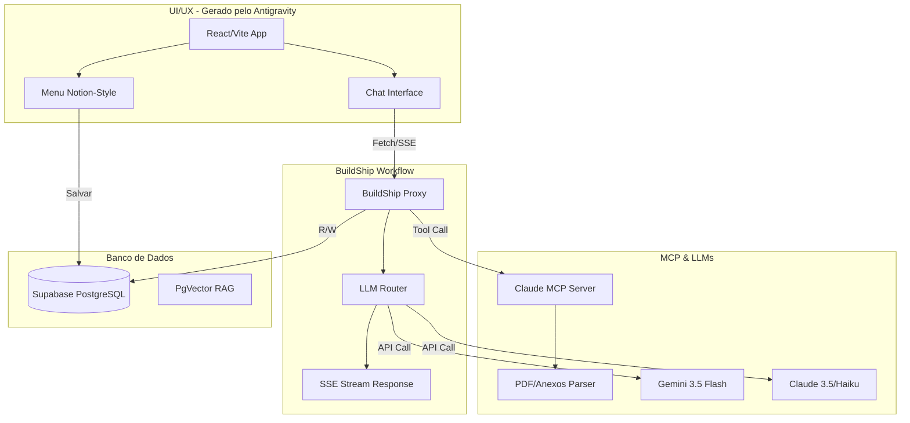

# Ybernator 2026: Arquitetura AI-Native (Zero Code Backend)

Este documento detalha o redesenho arquitetural completo do sistema educacional (Ybernator), aplicando o algoritmo de 5 etapas de Elon Musk, a filosofia KISS (Keep It Simple and Stupid), e as melhores práticas de 2026 para plataformas orientadas a IA.

## Algoritmo de 5 Etapas (Aplicado)

1. **Questionar os requisitos**: Precisamos realmente de Edge Functions escritas em Deno para roteamento LLM? (R: Não, orquestradores no-code são mais robustos hoje). Precisamos que a IA julgue cada avanço da ementa de forma generativa? (R: Não, progressão determinística de array reduz custos e falhas).
2. **Deletar partes/processos**: Excluir scripts de Edge Functions customizados (`/functions/chat/index.ts`), remover lógicas complexas de roteamento no frontend. Deletar widgets laterais não utilizados para simplificar a UI (já iniciado no Workspace).
3. **Simplificar e otimizar**: Frontend ultra-focado (React/Vite). "Cozinha" (Backend) gerida inteiramente por fluxo visual no-code.
4. **Acelerar o ciclo de tempo**: Substituir hard-coding por nós drag-and-drop no backend, permitindo ajustes rápidos de prompts e fluxos em minutos.
5. **Automatizar**: Automação final via Model Context Protocol (MCP) para extração inteligente de PDF/documentos sem intervenção manual.

## Decisões Arquiteturais Consolidadas

> [!IMPORTANT]  
> 1. **Plataforma No-Code**: Foi recomendado e definido o uso definitivo do **BuildShip** (pela facilidade de integração visual com Supabase, nós oficiais nativos, suporte a MCP e SSE Streaming out-of-the-box com menor custo inicial).
> 2. **Autenticação de Chaves API**: O sistema suportará **ambos os modelos** (Chave Global do Sistema para uso padrão + suporte a BYOK "Bring Your Own Key" para quem quiser plugar a própria conta).
> 3. **Hospedagem MCP**: O Servidor MCP será hospedado nativamente usando as "BuildShip Tools", visto que o proprietário não é desenvolvedor, garantindo manutenção e deploy com zero configuração de DevOps.

## Arquitetura Recomendada (2026)

A filosofia central é: **Código customizado apenas para a Experiência Visual (UI/UX). O resto é No-Code e Banco de Dados.**

## Proposed Changes

### 1. Camada UI/UX (Frontend React)
O Antigravity (eu) cuidará dessa camada com excelência visual, micro-animações e design state-of-the-art.

#### [NEW] `src/components/NotesContextMenu.tsx`
- Implementação da funcionalidade estilo Notion.
- Menu flutuante acionado com botão direito ou seleção de texto na resposta do Chat.
- Permite salvar trechos como "Notas de Estudo".

#### [MODIFY] `src/components/ChatWindow.tsx`
- Refatoração para consumir o endpoint No-Code (substituindo chamadas ao Edge Function local).
- Remoção de lógicas complexas de fallback de LLM (isso vai para o No-Code).
- Integração do Menu de Contexto (Notes).
- Ajuste no botão de encerramento para centralização.

#### [MODIFY] `src/pages/Sessao.tsx`
- Correção do Bug de "Retrieval Practice" (sessões reiniciando do zero).
- Adição do Modal de Reflexão ao encerrar tópico (feedback do usuário sobre o que aprendeu).

### 2. Camada Backend (No-Code Orchestration)
Vamos abandonar o `/supabase/functions/chat/index.ts`. Em seu lugar, criaremos um webhook/workflow num serviço como n8n ou BuildShip.
- **Funções:** Autenticação, Rate Limiting, Logging, Fallback de Modelos (Gemini -> Claude) e Streaming SSE.

### 3. Camada de Contexto e Inteligência (MCP)
- Utilizaremos o padrão Model Context Protocol (MCP).
- Quando o aluno fizer upload de um PDF ou material novo, a requisição passa pelo orquestrador e aciona as ferramentas MCP para extrair tópicos estruturados e populá-los diretamente no Supabase (`topicos_emergentes`).

## Verification Plan

### Manual Verification
1. O usuário validará o funcionamento da extração de notas (Notion-style) selecionando um texto e salvando.
2. Criaremos o workflow No-Code (fora deste repositório, em plataforma de sua escolha) e apontaremos a URL local do React (`VITE_NO_CODE_WEBHOOK_URL`) para testar o streaming LLM.
3. Upload de um anexo para testar se a arquitetura MCP extrai corretamente os tópicos.

---
**Status:** ⏸️ Planejamento aprovado e consolidado. A implementação está pausada conforme solicitado pelo usuário. Pronto para iniciar futuramente.

## Bug: Criação de Tópicos via Chips no Chat

### O Problema Identificado
Atualmente, quando você clica em um chip como "Crie um tópico sobre X", o sistema envia essa mensagem como um chat normal para a IA. 
A IA processa a mensagem e tenta retornar a tag `[CRIAR_TOPICO: X]`, ou então o frontend usa um "fallback" após a resposta da IA terminar. 
Porém, se a chamada da IA falhar (ex: sobrecarga) e cair no bloco `catch`, **o tópico não é criado e o erro é exibido na tela do chat sem criar o tópico**. O fluxo atual depende da IA terminar de gerar o texto para o tópico ser salvo.

### User Review Required
> [!IMPORTANT]
> O seu fluxo ideal proposto foi: `Usuário clica -> Chama API (Supabase) -> Insere na tabela -> Atualiza UI`.
> Isso significa que o clique no chip **não deve mais enviar uma mensagem para a IA no chat**, mas sim criar o tópico silenciosamente e mostrar um toast/loading de sucesso? Ou você ainda quer que a IA responda no chat ("Tópico criado com sucesso!") além da API fazer a inserção?
> Pelo seu diagrama, parece que você quer desacoplar a criação do tópico da resposta da IA.

### Proposed Changes

#### [MODIFY] `src/components/ChatWindow.tsx`
- Interceptar o clique nos `dynamicChips` (chips rápidos sugeridos no final da mensagem).
- Se o texto do chip for uma intenção de criar tópico (ex: "Crie um tópico sobre X"), **não chamaremos o `handleSend`**. Em vez disso:
  1. Ativamos um `loading state` local no botão do chip.
  2. Chamamos o Supabase diretamente (fazemos o `INSERT` na tabela `topicos_emergentes`).
  3. Tratamos os erros com um error boundary/toast visível (`toast.promise` ou `try/catch` explícito).
  4. Após o sucesso, atualizamos a UI invalidando a query do React Query para mostrar o novo tópico.
  5. (Opcional) Podemos adicionar uma mensagem silenciosa da IA confirmando, ou apenas usar o Toast.

Aguardo sua aprovação para iniciar essa mudança!
